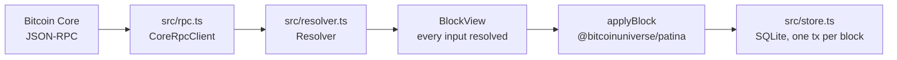

# Architecture

`index-patina` reads blocks from Bitcoin Core, derives PATINA state
deterministically, and serves that state over HTTP. It holds no keys, signs
nothing and broadcasts nothing.

Consensus lives somewhere else. Every constant, derivation, validity rule and
the state reducer itself come from the `@bitcoinuniverse/patina` package, which
this repository vendors and pins. `src/protocol.ts` re-exports that package and
defines no rules of its own. See [provenance.md](provenance.md).

## The ingest path

Four steps and nothing else:

1. **`rpc.ts`** is the only module that speaks JSON-RPC. It retries transport
   failures with bounded backoff and turns protocol errors into `RpcError`.
2. **`resolver.ts`** is the only step in the ingest path that touches the
   network. It fills in each input's prevout value, prevout scriptPubKey,
   prevout creation height and witness stack, producing a `BlockView`.
3. **`applyBlock`** comes from the protocol package. It is pure: no clock, no
   socket, no disk, no randomness. Given the same `BlockView` and the same
   deployment record it always returns the same events and the same next state.
4. **`store.ts`** writes one database transaction per block, together with an
   undo document. There is no state in which a block is half applied.

Because the reducer only ever sees a fully resolved `BlockView`, two operators
given the same blocks produce the same state root at every height, and a reorg
is undone by replaying the undo document rather than by guessing.

## Why the prevout creation height matters

A SEED reveal is only valid when the commit output it spends is at least
`COMMIT_MIN_AGE` blocks old. `getblock` at verbosity 2 does not carry the height
of the block that created an input, so the resolver looks the parent
transaction up with `getrawtransaction` and derives the height from the block
hash it reports.

That is why Bitcoin Core must run with `-txindex=1`. Without it the sync stops
with an error rather than assuming an age.

## Module map

| Module | Responsibility |
| --- | --- |
| `src/protocol.ts` | The single import point for consensus. Re-export only. Stamps `PARSER_VERSION` as `patina/<package version>`. |
| `src/config.ts` | Environment parsing, strict validation, deployment record resolution, the operator side of the mainnet gate. |
| `src/rpc.ts` | Bitcoin Core JSON-RPC client, plus an offline client that answers from an in-memory chain. |
| `src/resolver.ts` | Block and transaction resolution, with bounded prevout and block-height caches. |
| `src/facts.ts` | Reads a block back through the protocol package to recover storage details the state model does not carry, such as which input revealed the commit leaf. It makes no judgements. |
| `src/indexer.ts` | The sync loop, reorg detection and rollback, reindex, replay verification. |
| `src/store.ts` | SQLite access, migrations, snapshot rebuild, undo documents, checkpoints, all read queries. |
| `src/mempool.ts` | The provisional unconfirmed overlay. Never writes to a confirmed table. |
| `src/census.ts` | The per-epoch survival table. Reads only stored heights. |
| `src/api.ts` | Every read endpoint, as plain functions from request object to response object. |
| `src/http.ts` | Tiny router, fixed-window rate limiter, security headers, the `node:http` adapter. |
| `src/openapi.ts` | The OpenAPI document, built from the same base path the router uses. |
| `src/address.ts` | scriptPubKey to address rendering: bech32, bech32m, base58. |
| `src/serialize.ts` | Satoshis as decimal strings, heights as numbers, opaque page cursors. |
| `src/metrics.ts` | Prometheus text exposition, written by hand. |
| `src/logger.ts` | One JSON object per line on stdout. |
| `src/migrations.ts` | Every statement of DDL in the service. |
| `src/cli.ts` | Command line entry points. `bin/index-patina.mjs` calls `main()` from the build output. |
| `src/version.ts` | Reads this service's own version from its package manifest. |

## Determinism guarantees

Three separate checks make a silent divergence hard:

- **Per-block state roots.** Every `blocks` row stores the state root before and
  after the block. `index-patina verify` replays every stored block and compares.
- **Snapshot rebuild check on open.** The reducer snapshot is rebuilt from SQL at
  startup and its root is compared with the root recorded for the tip block. A
  mismatch refuses to serve.
- **Parser and specification binding.** The database records the network, the
  parser version and the deployment specification hash it was written with.
  Opening it with a different one fails with both values named, so a protocol
  package upgrade forces a `reindex` rather than a quiet mixed history.

## What this software is not

- It is not a wallet. It holds no keys and cannot sign or broadcast.
- It is not a marketplace, a mint or an issuance service. PATINA accrues history
  over an existing artifact; it does not create an asset. Nothing in this
  repository lists, prices, matches or settles anything.
- It is not the protocol. Rules, byte layouts and reason codes belong to
  [bitcoinuniverseio/patina](https://bitcoinuniverseio.github.io/patina/).
- It is not a Bitcoin node. It needs one, with `-txindex=1`.
- It is not a general purpose block explorer. It answers PATINA questions only.
