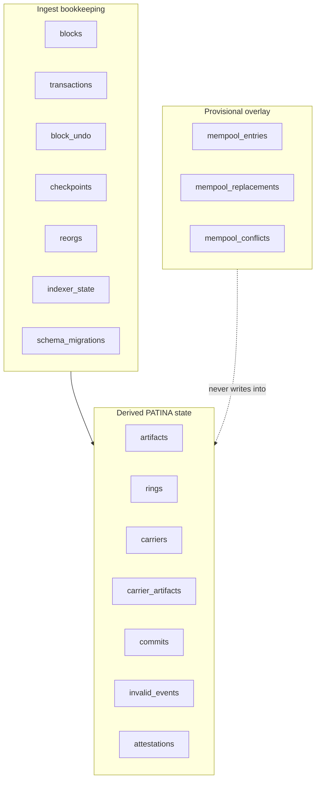

# Data model

One SQLite file. Seventeen tables, every statement of DDL in
`src/migrations.ts`. There is exactly one migration today,
`1 initial-patina-schema`, and `schema_migrations` records what has been applied.

## Portability

The SQL is written in the subset both SQLite and MySQL accept once the small
dialect differences are substituted. Integer primary keys are declared
explicitly rather than relying on rowid, JSON documents are stored as `TEXT`,
and no table definition uses a SQLite specific expression. `AUTOINCREMENT` is
the one dialect specific keyword. A MySQL adapter would be one file to port.

Satoshi amounts are stored as SQL `INTEGER`. The whole supply is
2 100 000 000 000 000 satoshis, below 2^53, so an int64 column and a JavaScript
number both hold it exactly. Rendering them as decimal strings in the API is a
serialization concern, not a storage concern.

## Table groups

### Ingest bookkeeping

| Table | Holds |
| --- | --- |
| `blocks` | One row per applied block: height (primary key), hash, previous hash, block time, transaction count, parser version, `state_root`, `prior_state_root`, event count, applied timestamp. |
| `transactions` | Protocol relevant transactions with their kind (`SEED`, `KEEP`, `CARRIER_SPEND`, `MARKER_ONLY`), marker version, opcode, output index and payload, and whether they were valid. |
| `block_undo` | One undo document per applied block, plus the state root that held before it. Pruned below `PATINA_UNDO_RETENTION_BLOCKS`. |
| `checkpoints` | Height, block hash, state root and headline counters, written every `PATINA_CHECKPOINT_INTERVAL` blocks. |
| `reorgs` | Fork height, depth, old tip, restored state root and whether that root verified. |
| `indexer_state` | Key and value pairs binding the database to one network, one parser version, one specification hash and a start height. |
| `schema_migrations` | Applied migration ids. |

### Derived PATINA state

| Table | Holds |
| --- | --- |
| `artifacts` | Artifact id (64 hex, primary key), birth transaction, endowment, founding flag, status (`ALIVE` or `RELIC`), current carrier, claimant x-only key, salt, commit outpoint and height, ring count, relic height. A check constraint enforces that an `ALIVE` artifact has a carrier and a `RELIC` does not. |
| `rings` | One row per closed ring: artifact id and ring index (composite primary key), start and end height, depth, carried value, successor outpoint, relic flag. |
| `carriers` | Outpoint (txid and vout, composite primary key), creation height, value, scriptPubKey, rendered address, spend height and spending txid. |
| `carrier_artifacts` | The many to many link between a carrier outpoint and the artifacts resting on it, with the height since which that has been true. |
| `commits` | Commit outpoints the indexer has seen revealed, marked `REVEALED` or `REJECTED`, with the commitment, claimant key, revealing transaction and resulting artifact. |
| `invalid_events` | Rejected protocol attempts with a frozen reason code from the protocol package, unique on (height, block index, sequence). |
| `attestations` | Artifact id, block hash, message, address, signature and whether it verified. Unique per artifact, block hash and address. |

Indexes exist for the access patterns the API actually uses: artifacts by
status, by founding flag, by carrier outpoint, by carrier address and by birth
height; carriers by address and by unspent state; rings by depth and by end
height; invalid events by recency and by reason.

### Provisional overlay

| Table | Holds |
| --- | --- |
| `mempool_entries` | One row per tracked unconfirmed transaction: kind, first and last seen, a summary document, affected artifacts and spent outpoints. |
| `mempool_replacements` | A departed transaction, an arriving transaction and the input they share. |
| `mempool_conflicts` | An outpoint two current entries both claim, with the two txids in sorted order. |

The mempool path never writes into a table in the other two groups. Dropping all
three overlay tables would leave confirmed state untouched.

## Why commits are recorded at reveal

A PATINA commit output is an ordinary taproot output until it is spent. Nothing
on chain distinguishes it beforehand. So `commits` holds outpoints the indexer
has actually seen revealed: `REVEALED` when the SEED was accepted, `REJECTED`
when a qualifying leaf was revealed but the SEED failed.
`POST /patina/safety/outpoints` also consults the mempool overlay, which lets it
flag a commit outpoint that an unconfirmed SEED is spending before that SEED
confirms.

## Integrity checks

`index-patina status` reports two things beyond heights and counters:

- **Missing tables.** Every name in `EXPECTED_TABLES` must exist.
- **Foreign key violations.** `PRAGMA foreign_key_check` must return nothing.

Either failing makes `status` exit 1. Separately, opening the database rebuilds
the reducer snapshot from SQL and compares its state root with the root recorded
for the tip block; a mismatch refuses to serve rather than answering from a
database that disagrees with itself.

## Counters

Aggregate counters (`artifacts_alive`, `artifacts_relic`, `founding_total`,
`rings_total`, `deepest_live_depth`, `endowment_total_sats`) are recomputed from
the same rows rather than stored separately. They are not trusted on their own:
the rebuilt snapshot they belong to is checked against the tip state root at
startup. If `verify` is clean, the state is correct and the counters follow.
