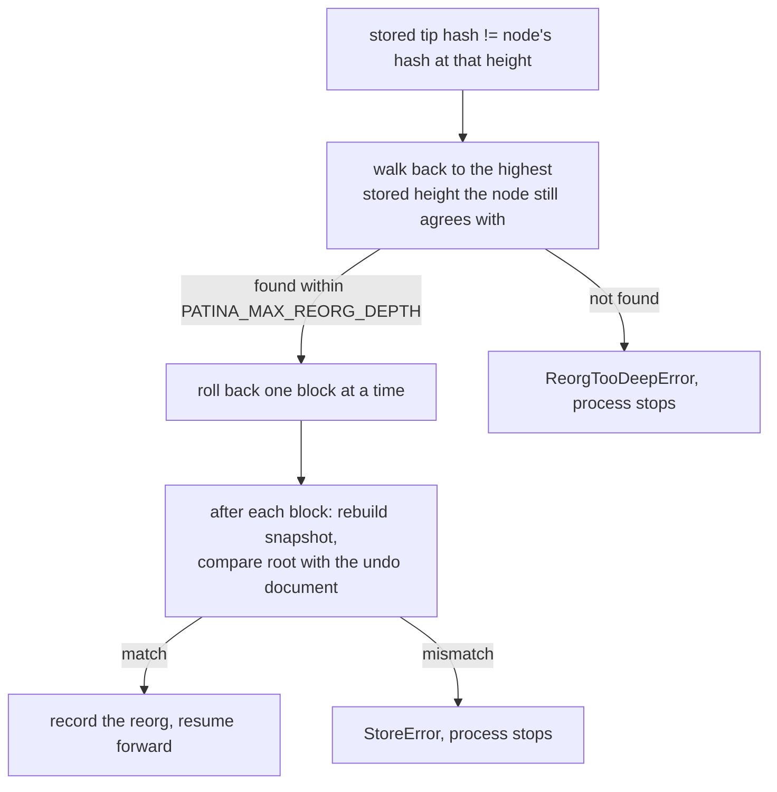

# Synchronization, reorgs and the mempool

## The sync loop

`syncOnce()` does three things, in this order:

1. **Refresh the tip.** `getblockchaininfo` gives the node's current height.
2. **Check the stored tip is still on the node's chain.** `getblockhash` at the
   stored tip height must return the stored hash. If it does not, or the call
   fails, a reorg is handled before anything else.
3. **Apply forward.** For every height from `indexed + 1` to the tip, resolve the
   block and apply it. Before each block is applied, its `prevHash` is compared
   with the stored tip hash; a mismatch triggers reorg handling and the loop
   restarts from the new indexed height.

`run()` repeats `syncOnce()` forever. Once caught up it sleeps
`PATINA_POLL_INTERVAL_MS` between passes, and refreshes the mempool overlay at
most every `PATINA_MEMPOOL_POLL_INTERVAL_MS`. A failed pass is logged and
retried after the same interval rather than crashing the process.

The sleep wakes immediately when a shutdown is requested, so `SIGINT` and
`SIGTERM` do not wait out a poll interval.

## Initial indexing

The first indexed height defaults to the deployment's window opening height
minus `commit_min_age`, floored at zero. That is the earliest block that can
matter, because a SEED cannot spend a commit output younger than
`commit_min_age`. Set `PATINA_START_HEIGHT` to override.

Blocks are applied one at a time, each in its own database transaction with its
undo document. There is no batch mode and no parallel apply: determinism and a
never-half-applied database are worth more here than raw throughput.

**What governs speed.** Nearly all the wall clock time is Bitcoin Core RPC. Each
block costs one `getblock` at verbosity 2, plus one `getrawtransaction` for
every input whose prevout is not already in the resolver cache. The resolver
holds up to 200 000 prevouts and 20 000 block heights in memory, so inputs that
spend recent outputs resolve locally.

**What we have measured, and what we have not.** The offline regtest suite
indexes and replays its synthetic chains in seconds. We have not published a
mainnet or signet backfill duration here, because PATINA mainnet is fail closed
and not activated: there is no mainnet history to index and no honest number to
quote. Measure against your own node before planning a deployment, and expect
the node, not this process, to be the limit.

**Disk.** Roughly 200 MB for a signet database. Mainnet is larger and the exact
size depends on how much protocol activity exists, which for an unactivated
deployment is zero.

## Reorganization handling

The fork height search walks down from the indexed height to
`max(first indexed height, indexed - PATINA_MAX_REORG_DEPTH)`, asking the node
for the hash at each height. The first height whose hash still matches what is
stored is the fork point.

Rollback is not a guess. Each block is undone by replaying its stored undo
document, and after each step the snapshot is rebuilt from SQL and its state
root compared with the root the undo document recorded. A disagreement stops the
process instead of serving state nobody can reproduce.

Every reorg is written to the `reorgs` table with the fork height, the depth,
the old tip, the restored state root and whether that root verified.

Two deliberate hard stops:

- **Deeper than `PATINA_MAX_REORG_DEPTH`.** The process stops rather than rolling
  back blindly. Confirm with your node how deep the reorg went, then
  `reindex-range --from <fork height + 1>`.
- **Past the retained undo window.** Undo documents below
  `PATINA_UNDO_RETENTION_BLOCKS` are pruned, so a reorg reaching further cannot
  be undone in place. `reindex-range --from <fork height + 1>` rebuilds from
  chain data instead of undo documents.

## Mempool handling

The overlay answers three questions an operator actually has:

- which unconfirmed transactions would touch a live carrier,
- which unconfirmed transaction replaced which other one,
- which unconfirmed transactions are fighting over the same outpoint.

Each refresh reads `getrawmempool`, fetches transactions it has not seen,
resolves them through the same resolver, and classifies each against the
confirmed snapshot:

| Condition | Kind |
| --- | --- |
| A valid marker decodes with op SEED | `SEED` |
| A valid marker decodes with op KEEP | `KEEP` |
| A marker output is present but does not decode, or several are | `MARKER_ONLY` |
| No marker, but an input spends a known live carrier | `CARRIER_SPEND` |
| None of the above | not tracked |

For a pending SEED, any taproot script path input is recorded as a candidate
commit outpoint. That is provisional by construction: the reveal is not
confirmed, so it is never written to the `commits` table.

**Replacements.** When an entry leaves the mempool and an arriving entry shares
one of its inputs, the newcomer is recorded as a replacement of the departed
transaction, with the shared outpoint.

**Conflicts.** When two entries currently in the overlay claim the same
outpoint, the pair is recorded, with the two txids in sorted order so the same
conflict is never stored twice.

**Confirmation.** When a block is applied, its txids are dropped from the
overlay.

A transaction whose prevout cannot be resolved (typically an unconfirmed parent
that is not yet known) is skipped and picked up on a later pass rather than
failing the refresh.

The overlay is refreshed only while the indexer is caught up to the tip, so a
backfill is never slowed by mempool work. Set `PATINA_MEMPOOL_ENABLED=false` to
turn it off entirely.
